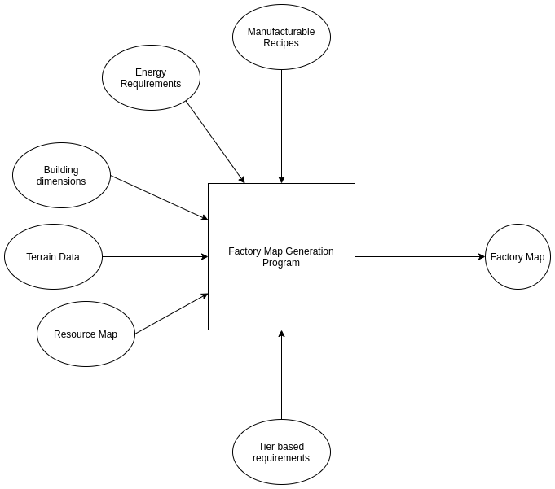
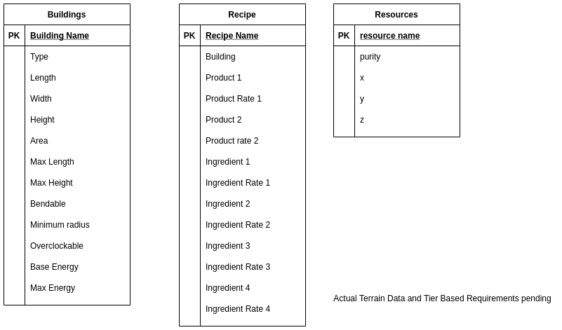
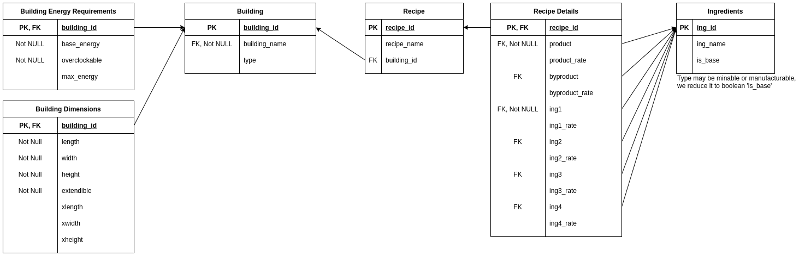

# Satisfactory Data Analysis


This repository is a Jupyter Notebook managed repository. It contains information for 
planning within the game Satisfactory. It has a related project, which has been detailed below.

## Running

```shell
git clone https://github.com/supratikchatterjee16/satsifactory-notebook.git satisfactory-notebook
cd satisfactory-notebook
jupyter-lab
```

## Project

### Statement

Using the information about the game available to us, create a program that is able to create symmetrical architectures,
packing the machines within itself.

By doing so, we can design efficient manufacturing plants, with low regards for the manufacturing requirements, and pay more attention to architecture within the game, to achieve beautiful designs such as the ones we see below :

1. https://www.youtube.com/watch?v=QQeO1RyHrsA
2. https://www.youtube.com/watch?v=djcqGe02tdc&t=40s
3. https://www.youtube.com/watch?v=98ujAFCWGoQ

### Design

We do not need to work on feature extraction, as we intend to solve a problem statement, rather than make a 'product' or 'service'.

The functional design is as such : 



#### Data

The data is sourced and stored as raw non-normalized data first.
It takes the form of : 



After normalization, it takes the form of : 



#### 


## Parts of the project

### Completed

1. Gathering data regarding mines and resources on the map
2. Normalization of the data map data
3. Visualization of nodes on map
4. K-Means clustering for logistical evaluation on single node
5. Extension of K-Means clustering for multiple resources
6. Recipe data gathering
7. Data normalized from satisfactory-calculator(outdated)
8. Normalized data downloaded from wiki(updated and current)
9. Recipe extraction for any item
10. Getting building count and energy for the recipe tree

### Remaining

1. By-product handling
2. Energy cost for generating the energy itself.
3. Packing for industry
4. Logistical planning
5. Super structure planning

## Credits

The Satisfactory team and their community manager
